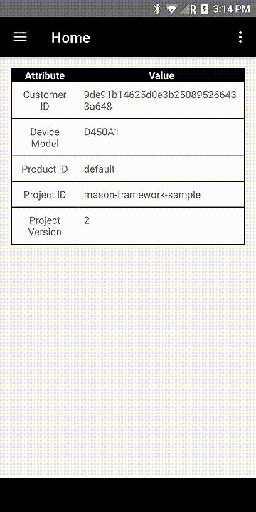

# Mason Framework Sample
Example project demonstrating the usage of the Mason Framework SDK on a Mason device.



## Prerequisites
- Provision your Mason device, follow the [guide here](https://docs.bymason.com/guides/quickstart).
- [Framework SDK Documentation](https://docs.bymason.com/devices/sdk#framework-sdk).
- Download and install the latest [Mason CLI](https://github.com/MasonAmerica/mason-cli/releases).

## Usage
Use the provided `mason.yml` as a template for your own Mason project.

1. Log in to your Mason Controller account.
2. Create a project called **mason-framework-sample**.
3. Create a group called **framework-demo**.
4. Move your Mason device to the group **framework-demo**.
5. Clone the repo https://github.com/MasonAmerica/Mason-Framework-Sample.
6. Build a signed APK. If you need help with signing, refer to this [guide](https://developer.android.com/studio/publish/app-signing).
7. Register your signed APK using the Mason CLI command:
```sh
$ mason register apk /path/to/<MY_APP>.apk
```
8. Register, build, and deploy your `mason.yml` (also know as a project/configuration file) using the Mason CLI command:
```sh
$ mason register -y config --await mason.yml && mason deploy -p -y config mason-framework-sample latest framework-demo
```

In a few seconds your Mason device will download and install the OTA update!